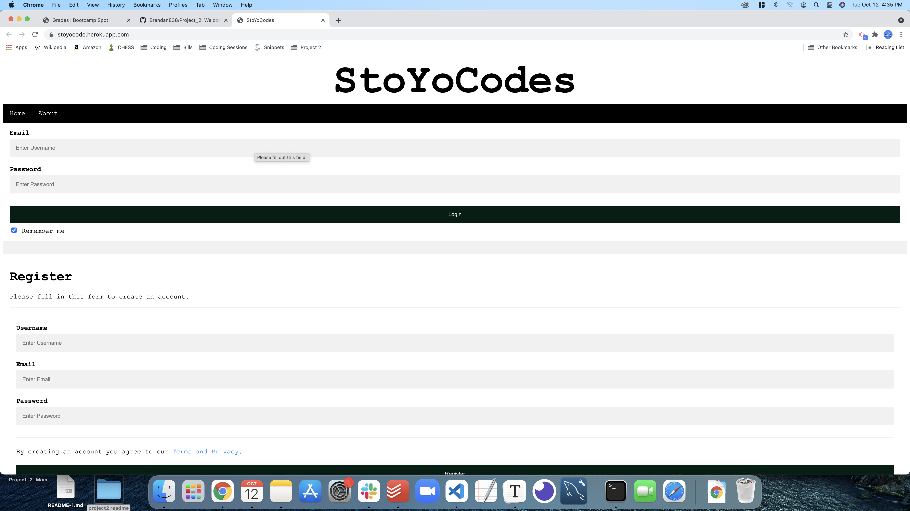
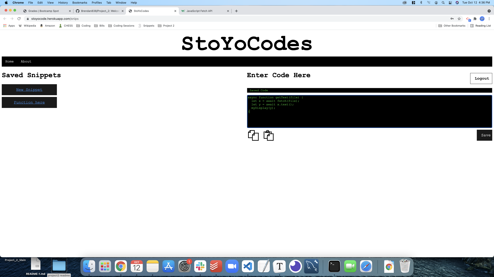

# groupProject_team Five Guys Coding Fries

>  [Deployed site!](https://stoyocode.herokuapp.com/) <!-- If you have the project hosted somewhere, include the link here. -->

## Table of Contents

- [Description](#general-information)
- [Technologies Used](#technologies-used)
- [Screenshots](#screenshots)
- [Acknowledgements](#acknowledgements)
- [Contact](#contact)
<!-- * [License](#license) -->

## Description

Hello, welcome to the StoYo Code repo. The purpose of this application is to enhance the efficiency of developers by giving them an application to store code snippets. Visit our deployed site, sign up, and try it out!

This application uses node.js, as well as npm libraries including express, mysql2, sequelize, bcrypt, and express-handlebars. 

<!-- You don't have to answer all the questions - just the ones relevant to your project. -->

## Technologies Used

- Front end: HTML5, CSS, Javascript
- Back-end: node.js, express, sequelize(mySQL)

## Screenshots

## Acknowledgements

- Many thanks to Trilogy Education.

## Contact

Created by

- [@Schoen9576](https://github.com/Schoen9576)
- [@Brendan838](https://github.com/Brendan838)
- [@ristjosh](https://github.com/ristjosh)
- [@Jackgoers96](https://github.com/Jackgoers96)
- [@Rhandom1](https://github.com/Rhandom1)

